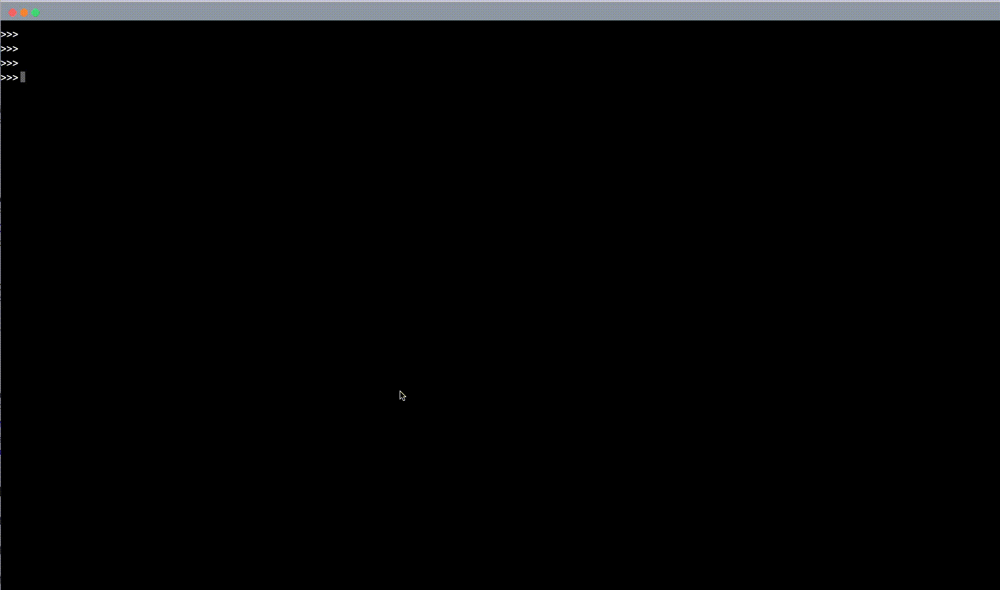

# typescript-vite-react-text-terminal-imitation

テキストターミナル風 UI



[react-text-terminal-imitation](https://github.com/hironomiu/react-text-terminal-imitation)を Vite ＋ TypeScript + Tailwind + Jotai で再作成変更

## Dev Server Run

```
npm run dev
```

## Install Memo

`React`,`TypeScript + SWC`を選択

```
npm create vite@latest .
npm install
```

### Tailwind

[Tailwind 公式](https://tailwindcss.com/docs/guides/vite)

### Jotai

```
npm install jotai
```
